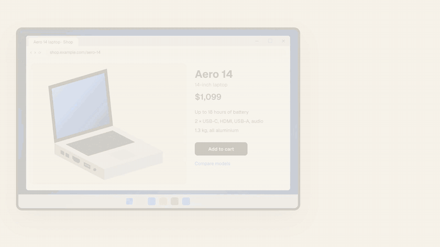
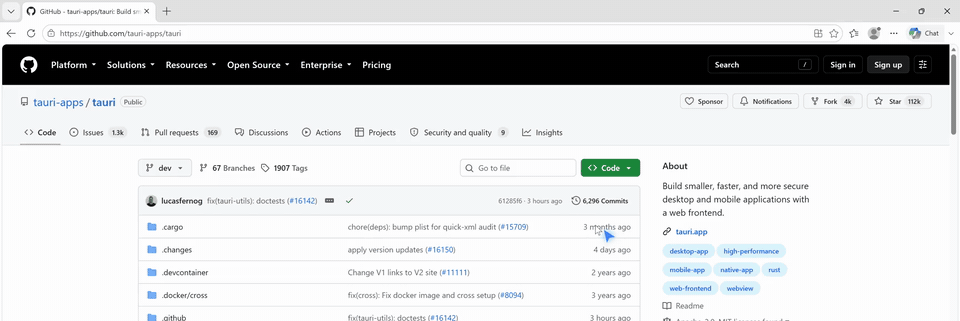

<p align="center">
  
</p>

<h1 align="center">Flitty</h1>

<p align="center">
  <b>Ask out loud. Flitty shows you exactly where to click.</b><br />
  A tiny AI buddy that lives next to your cursor: it answers in a voice, captions the answer,<br />and flies straight to the button you need. Built for Windows, works on macOS.
</p>

<p align="center">
  <a href="https://github.com/alexriderspy/heyflitty/releases/latest"></a>
  
  <a href="LICENSE"></a>
  <a href="https://github.com/alexriderspy/heyflitty/stargazers"></a>
</p>

<p align="center">
  <a href="https://github.com/alexriderspy/heyflitty/releases/latest"><b>Download for Windows</b></a> ·
  <a href="#how-it-works">How it works</a> ·
  <a href="#privacy">Privacy</a> ·
  <a href="https://github.com/alexriderspy/heyflitty/issues/new/choose">Report an issue</a> ·
  <a href="CONTRIBUTING.md">Contribute</a>
</p>

<p align="center">
  <a href="https://alexriderspy.github.io/heyflitty/flitty-launch.mp4"></a>
  <br /><sub>Hold a hotkey, ask, and it points to the exact spot. <a href="https://alexriderspy.github.io/heyflitty/flitty-launch.mp4">Watch the 40-second launch film with sound ▶</a></sub>
</p>

---

## Why Flitty

Flitty is inspired by HeyClicky, which showed how good an AI buddy on your screen can feel. HeyClicky is Mac-only and closed; Flitty brings the idea to Windows and keeps it open.

| | |
|---|---|
| 🪟 **Windows first** | Windows 10 and 11, x64 and ARM64. macOS works too. |
| 🎯 **Points at the real button** | On Windows it reads the names and positions of on-screen controls through UI Automation, so the cursor lands exactly on them. |
| 💬 **Talks and captions** | Answers out loud with your system voice, with every sentence captioned next to the cursor. |
| 🔒 **Your key, your data** | No account, no subscription, no Flitty server. It talks to OpenAI directly with your own key. |
| 🧩 **Open source** | MIT licensed. Read it, fork it, make it yours. |

## Install

1. Download `Flitty_<version>_x64-setup.exe` from the [latest release](https://github.com/alexriderspy/heyflitty/releases/latest) (`arm64` for Snapdragon laptops).
2. Run it. It installs for your user only, no admin rights needed.
3. Click the Flitty icon in the system tray → **Settings** → paste your [OpenAI API key](https://platform.openai.com/api-keys) → **Test key**.

> [!NOTE]
> The installer isn't code-signed yet, so Windows may show "Windows protected your PC". Click **More info → Run anyway**.

<details>
<summary><b>macOS</b></summary>

There's no signed Mac download yet, so run it from source (see [Build from source](#build-from-source)). The first time, macOS asks for Microphone and Screen Recording permission.
</details>

## How it works

1. **Hold <kbd>Ctrl</kbd> + <kbd>Alt</kbd> + <kbd>Space</kbd>** and ask a question out loud. Flitty records only while you hold the keys.
2. **Let go.** It transcribes your question, takes a screenshot, and on Windows reads the clickable controls in the focused window.
3. **It answers.** An OpenAI model replies; Flitty speaks and captions it sentence by sentence as it streams in.
4. **It points.** The model names the control it means, and Flitty's cursor flies to that control's real position. For things that aren't standard controls (a photo, a diagram, a game), it points by screen coordinates instead.

Ask about **"this"** and Flitty looks at whatever your mouse is on: rest the pointer on a port in a photo and ask "what's this?", and it names the port and points at it.

<details>
<summary><b>See a real recording</b></summary>
<br />

<br /><sub>Windows 11, unedited. Asked: <i>"where can I see the open issues?"</i></sub>
</details>

## Privacy

- Flitty only records while you **hold the hotkey**, and takes a screenshot only when you **let go**.
- Audio, the screenshot and the list of on-screen controls go **straight from your computer to OpenAI** using your key. There is no Flitty server.
- Recordings and screenshots are never saved to disk. Your API key is stored in Windows Credential Manager (Keychain on macOS).

## Build from source

You need [Rust](https://rustup.rs), [Node.js](https://nodejs.org) 20+, and on Windows the Visual Studio C++ Build Tools.

```bash
git clone https://github.com/alexriderspy/heyflitty.git
cd heyflitty
npm install
npm run tauri dev
```

Build the Windows installer with `npm run tauri build -- --bundles nsis`.

## Report issues and contribute

- **Found a bug?** [Open an issue](https://github.com/alexriderspy/heyflitty/issues/new/choose) with your Windows version and the message Flitty showed next to the cursor.
- **Have an idea?** Open a feature request, or send a pull request. [CONTRIBUTING.md](CONTRIBUTING.md) explains how to build and test, including a mock OpenAI server so you don't need a key.

Contributions require agreeing to the [CLA](CLA.md).

## License

MIT. See [LICENSE](LICENSE).

Flitty's system prompt is adapted from [Clicky](https://github.com/farzaa/clicky) (MIT); see [THIRD_PARTY_NOTICES.md](THIRD_PARTY_NOTICES.md). Licenses of all bundled dependencies are in [THIRD_PARTY_LICENSES.txt](THIRD_PARTY_LICENSES.txt), shipped with the installer.
